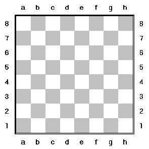

# Python Getting started
> This file contains a collection of introductory Python exercises focused on input/output operations, arithmetic, conditionals, and basic logic. The tasks gradually build programming fundamentals through small, practical problems such as temperature conversion, time calculations, random number generation, and tax computation.

## Tasks
### Input/Output, Operations on Primitive Types

1. Printing (G)

Write a program **print.py** that prints the phrase Knowledge is power!
on one line, on three lines, one word on each line,
inside a rectangle made up by the characters = and |.
Executing the program should give the following output:
```
Knowledge is power!

Knowledge
   is
  Power!

=========================
|                       |
|  Knowledge is power!  |
|                       |
=========================
```

2. Quote (G)

Write a program **quote.py** which reads a line of text from the keyboard and then prints the same line as a quote (that is inside " "). An example of an execution:
```
Write a line of text:  May the Force be with you!
Quote: "May the Force be with you!"
```

3. Fahrenheit (G)

Write a program **fahrenheit.py** that reads a The Fahrenheit temperature F (a float) from the keyboard and then print the corresponding Celsius temperature C. The relationship between C and F is:
```
F = (9/5)*C + 32
```
An example of an execution:
```
Provide a temperature in Fahrenheit: 100
Corresponding temperature in Celsius is 37.77778
```

4. Interest (G)

Write a program **interest.py** which computes the value of your savings S after Y years given a certain interest rate P (percentage). You can assume that S, Y and P are integers. The value should be an integer correctly rounded off. Input will given by the user via the keyboard. An example of an execution:
```
Initial savings: 1000
Interest rate (in percentages): 9
Number of years: 5

The value of your savings after 5 years is: 1539
```

5. Volume (G)

Create a program **volume.py** that asks for the radius of a sphere and prints the volume. The result should be presented with a single decimal correctly rounded off. An example of an execution:
```
Provide a radius: 6
The volume is 904.8
```

6. Time (G)

Write a program **time.py**, which reads a number of seconds (an integer) and then prints the same amount of time given in hours, minutes and seconds. An example of an execution:
```
    Give a number of seconds: 9999
    This corresponds to: 2 hours, 46 minutes and 39 seconds.
```
Hint: Use integer division and the modulus (remainder) operator.


7. Sum of Three (VG)

Write a program **sumofthree.py** which asks the user to provide a three digit number. The program should then compute the sum of the three digits. **Note:** you may _not_ convert the input from an integer to a string or a list (or anything else), you need to _calculate_ the answer. For example:
```
Provide a three digit number: 456
Sum of digits: 15
```

8. Change (VG)

Write a program **change.py** that computes the change a customer should receive when she/he has paid a certain sum. The program should exactly describe the minimum number of Swedish bills and coins that should be returned rounded off to nearest krona (kr). Example:
```
Price: 372.38
Payment: 1000

Change: 628 kr
1000kr bills: 0
 500kr bills: 1
 200kr bills: 0
 100kr bills: 1
  50kr bills: 0
  20kr bills: 1
  10kr coins: 0
   5kr coins: 1
   2kr coins: 1
   1kr coins: 1
```

### If statements and extra material

9. Positive, Zero, or Negative (G)

Write a program **positive.py** which reads an integer and then classifies (and prints) it as positive, zero, or negative. For example
```
Please provide an integer: -27
-27 is negative
```

10. Largest (G)

Write a program **largest.py** which reads three integers A, B, C and then prints the largest number. You should solve this problem using if statements. You are not allowed to use any of the max and sort functions that comes with Python. For example
```
Please provide three integers A, B, C.
Enter A: 23
Enter B: 46
Enter C: -11

The largest number is: 46
```

11. Classify Numbers (G)

Write a program **oddpositive.py** which generates a random number in the interval [-10,10] and classifies it as odd/even and as positive/negative. Use the function random.randint in the random module. No reading from the keyboard in this exercise. Two examples
```
The generated number is -7
-7 is odd and negative

The generated number is 0
0 is even and neither positive nor negative
```

12. Short Name (G)

Write a program **shortname.py**, reading a first name, a middle name and a last name (given name and family name) as strings. The output should consist of the first letter of the first name followed by a dot and a space, first letter of the middle name followed by a dot and a space and then followed by the first four letters of the last name. An example of an execution:
```
First name: Jabba  
Middle name: Desilijic
Last name: Tiure
Short name: J. D. Tiur
```
Also known as Jabba the Hutt... 😁

13. Random Number (G)

Write a program called **randomsum.py** generating and printing the sum of five random numbers in the interval [1,100]. For example

```
    Five random numbers: 78 13 91 2 36
    
    The sum is 220
```

14. Taxes (VG)

In a (very) simplified version of the Swedish income tax system we have three tax levels depending on your monthly salary:

* You pay a 30% tax on all income below 38.000 SEK/month
* You pay an additional 5% tax on all income in the interval 38.000 SEK/month to 50.000 SEK/month
* You pay an additional 5% tax on all income above 50.000 SEK/month

Write a program **tax.py** which reads a (positive) monthly income from the keyboard and then prints the corresponding income tax. For example
```
Please provide monthly income: 32000
Corresponding income tax:  9600

Please provide monthly income: 46000
Corresponding income tax:  14200

Please provide monthly income: 79000
Corresponding income tax:  27200
```


15. Chess Square Color (VG)



Each square on a chess board in identified by a letter (a-h) and an integer (1-8). They are typically refered to as c3 or f5. Write a program **squarecolor.py** that reads a square identifier (e.g. e5) from the keyboard and prints the color (Black or White). Example execution:
```
    Enter a chess square identifier (e.g. e5): c6
    
    c6 is White
```
