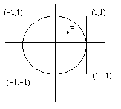

# Python -- Iterations
> This file contains a complete set of **Python programming exercises** designed to teach the fundamentals of iteration, functions, strings, and lists. It includes both basic (G) and advanced (VG) tasks, covering topics such as loops, conditionals, number theory, randomization, and data manipulation, all meant to build foundational programming skills.


## Tasks
The following tasks are marked as G for Pass or VG for Pass with distinction. As per the above instructions, the G tasks must be done and shown at the deadline to the teachers in the lab session. There are eleven tasks marked as G and you need to do all of them.


### Iterations

1. Sum even 100 (G)

This program should sum all even numbers up to 100, excluding 0 but including 100. No input is required. Call the program **all_even.py**.

```
Sum of the 100 first even numbers is: 2550
```

2. Print odd (G)

Write a program **print_odd.py** which for any given positive integer n (read from the keyboard) prints all odd numbers between 1 and n. You should print it in two different ways: first using a for statement and a second time using a while statement. Example of an execution:

``` python
Enter a positive integer: 10

Odd numbers using for: 1 3 5 7 9 
Odd numbers using while: 1 3 5 7 9
```


3. Largest and smallest K (G)

Write a program **find_k.py** which for any given positive integer *n* (read from the keyboard):
 - First computes the smallest integer k such that 1 + 3 + 5 +... + k > n.
 - Then,  computes the largest integer k such that 0 + 2 + 4 + ... + k < n.
 
 Notice: The program should terminate with a suitable error message if a non-positive n is provided. An example of an execution:

```
Enter a positive integer: 25

11 is the smallest k such that 1+3+5+...+k > 25
8 is the largest k such that 0+2+4+6+...+k < 25
```

4. High-low (G)

Write a program **highlow.py**, implementing the game High and Low. The computer chooses a random integer between 1 and 100 and lets the user guess the value. After each guess, the user is given a clue of the type higher or lower. An example of an execution:

```
Guess 1: 67
   Clue: higher
Guess 2: 82
   Clue: lower
Guess 3: 77
   Correct answer after only 3 guesses - Excellent!
```
After 10 guesses, the program ends with a suitable comment.

5. Print primes (G)

Create a program called **print_primes.py** that asks for a number of prime numbers to print. The program should then print them ten at a line and then continue on the next line. You can read more about prime numbers on [Wikipedia](https://en.wikipedia.org/wiki/Prime_number)

```
How many primes? 50
2 3 5 7 11 13 17 19 23 29
31 37 41 43 47 53 59 61 67 71
73 79 83 89 97 101 103 107 109 113
127 131 137 139 149 151 157 163 167 173
179 181 191 193 197 199 211 223 227 229
```

6. Random numbers (G)

Write a program **random_numbers.py** that reads a positive integer **n** from the keyboard and then:
- Generates and prints (in a single line) *n* random numbers in the interval [1,100]
- Prints the average value (with two decimals), the smallest number (min), and the largest number (max).
A suitable error message should be presented if the input number *n* is non-positive. You should _**not**_ use a list (or any other data structure) to first store the generated numbers before you compute average, min, and max.

An example of an execution:
```
Enter number of integers to be generated: 10

Generated values: 77 15 13 54 96 73 100 12 98 28 
Average, min, and max are 56.6, 12, and 100
```

7. Print Triangles (G)

Write a program **triangle.py** reading a positive odd integer n from the keyboard, and then prints two triangles. First a right-angled triangle, then an isosceles triangle. See example below to see what we mean by right-angled and isosceles triangles.
```
Enter an odd positive integer: 7

Right-Angled Triangle:
*******
 ******
  *****
   ****
    ***
     **
      *

Isosceles Triangle:
   *
  ***
 *****
*******
```

8. Counting Digits (VG)

Write a program **countdigits.py**, which for any given positive number _n_ (read from the keyboard) prints the number of zeros, odd digits, and even digits of the integer. In this case we consider zeros to be neither odd nor even. An example of an execution:
```
Enter a large positive integer: 6789500

Zeros: 2
Odd: 3
Even: 2
```

9. Birthday (VG)

Write a program **birthday_candles.py** that computes how many boxes of candles a person needs to buy each year for her\his birthday cake. You can assume that the person reaches an age of 100, the number of candles used each year is the same as the age, that you save non-used candles from one year to another, and that each box contains 24 candles. Also, at the end, we want you to print the total number of boxes one has to buy, and how many candles that are available after having celebrated the 100th birthday. An example of an execution:

```
Before birthday 1, buy 1 box(es)
Before birthday 7, buy 1 box(es)
Before birthday 10, buy 1 box(es)
Before birthday 12, buy 1 box(es)
Before birthday 14, buy 1 box(es)

...

Before birthday 95, buy 3 box(es)
Before birthday 96, buy 4 box(es)
Before birthday 97, buy 5 box(es)
Before birthday 98, buy 4 box(es)
Before birthday 99, buy 4 box(es)
Before birthday 100, buy 4 box(es)

Total number of boxes: 211, Remaining candles: 14
```
**Notice:** In our example we only have a print-out of those birthdays where you must buy boxes. In the non-printed years (e.g. 2-6 and 8-9) you can handle the birthdays without having to buy any more candles.

### Functions

10. Distance (G)

Inside file **distance.py**, create a function **distance(x1,y1,x2,y2)** which computes the distance between two points _x1,y1_ and _x2,y2_ using the formula
```
distance = Sqrt( (x1-x2)^2 + (y1-y2)^2 )
```

Sqrt() means "the square root of" and ^ means "raised to".

Also, add program code so that a user can provide the point coordinates and get the distance. The answer should be presented with three decimal digits as in the example below:
```
Enter x1: 1
Enter y1: 1
Enter x2: 5
Enter y2: 6

The distance between (1.0,1.0) and (5.0,6.0) is 6.403
```

11. Math Functions (G)

Create a program called **simple_math.py** in which you have seven functions:
```python
def inc(n)           #  Increments n with one
def inc_with(n, t)   #  Increments n with the value of t
def greatest(n1, n2) #  Returns the largest of the values n1 and n2
def is_even(n)       #  Returns True if n is even, otherwise false
def power(x, n)      #  Returns x to the power of n
def factorial(n)     #  Returns the factorial of n
def is_prime(n)      #  Returns True if n is a prime, otherwise false
```

You may _not_ use the Math library in Python to implement the functions above, but you must give them an implementation. Below your implemented functions, you should have a number of calls to the functions. The calls can, but must not, look like below:

```python
print('41 plus 1:', inc(41))
print('30 plus 12:', inc_with(30, 12))

print('Which is greater, 24 or 42?', greatest(24, 42))

print('Is 42 even?: ', is_even(42))

print('2 to the power of 10:', power(2, 10))

print('Factorial of 5:', factorial(5))

print('Is 41 a prime?:', is_prime(41))
```

If you use the calls above, the output will be:

```
41 plus 1: 42
30 plus 12: 42
Which is greater, 24 or 42? 42
Is 42 even?:  True
2 to the power of 10: 1024
Factorial of 5: 120
Is 41 a prime?: True
```

12. String functions (G)

Inside file **string_functions.py**, create the string related functions we describe below. In a separate file **stringmain.py**, write a program showing how the different functions defined in string_functions.py can be used.
- A function concat(s, n) that returns the result of concatenating the string s with itself n times
- A function count(s, x) that returns the number of times the character x occurs in the string s. For example, for the string s="hello" and character x="l" the function should return 2.
- A function reverse(s) that returns a string with all the characters in s in reverse order.
- A function first_last(s) that returns the first and last characters in the string s. Notice: two return values.
- A function has_two_X(s) that return True if the string contains exactly two instances of the character X, otherwise False.
- A function has_duplicates(s) that returns True if the string s contains any duplicate characters, otherwise False.

**Notice:** You can assume that the arguments used in a call to any of these functions are of the correct (expected) type. Also, notice that this exercise doesn't require any input.


13. ABCD (VG)

There are four different digits A, B, C, and D such that the number DCBA is equal to 4 times the number ABCD. What are the four digits? Note: to make ABCD and DCBA a proper four digit integer, neither A nor D can be zero. The name of the program computing A, B, C, and D should be named **abcd.py**.

**Hint:** Use a quadruple nested loop and a function get_number(a, b, c, d) that converts digits a, b, c, d into a four digit integer abcd.

14. Calculating Pi (VG)



Assume a unit circle centred around origin inside a square with sides 2 like in the figure above. Assume also that we randomly generate N points (x,y) where both x and y are within the range [- 1,1]. The proportion of points inside the circle should then approximately be the same as the ratio between the circle area pi*R*R (which equals pi since R=1) and the square area 4. This relation can be used to compute an approximation of pi. Write a program pi_approx.py that computes (and prints) a pi approximation for N=100, N=10000, and N=1000000. Print also the error (i.e. the absolut value of pi_actual - pi_approx).

### Lists

15. Only positives (G)

Create a program **only_positives.py** that reads an arbitrary number of positive integers from the keyboard and then prints them in a single line. The reading stops when the user inputs a negative number. An example of an execution:

```
Enter positive integers. End by giving a negative integer.
Integer 1: 5
Integer 2: 100
Integer 3: 15
Integer 4: 20
Integer 5: -7

Number of positive integers: 4
Positive numbers: [5, 100, 15, 20]
```
16. Frequency table (G)

Write a program **two_dice.py** that use the random module to simulate that you are rolling two dice 10000 times. At the same time, keep track of the number of times you get the result (adding the dice values) 2, 3, ..., 11, 12. (Use a list to store a count of the numbers.) After the simulation, present the frequencies for the different numbers. An example of an execution:
```
Frequency table (sum,count) for rolling two dices 10000 times
2	267
3	555
4	833
5	1101
6	1346
7	1690
8	1399
9	1083
10	862
11	580
12	284
```
**Note:** No input in this program. It should just present a randomly generated frequency table,

17. Lotto (G)

The Swedish Lotto works by randomly selecting seven of 35 numbers (in sequence). Write a program called **lotto.py** which creates a valid lotto sequence, that is seven numbers in the range from 1 to 35 in ascending order without duplicates. See below for an example execution:
```
The Lotto numbers this week:
5 6 18 21 24 31 32
```
Note: No input in this program. It should just present a valid (randomly selected) lotto sequence,

18. List functions(G)

Inside file **list_functions.py**, create the list related functions we describe below. In a separate file **list_main.py**, write a program showing how the different functions defined in list_functions.py can be used.
- A function random_list(n) that returns a list containing n random integers in the interval 1 to 100.
- A function average(lst) returning the average (a rounded off integer) of all values in the list lst.
- A function only_odd(lst) that returns a new list containing only the odd integers in lst.
- A function to_string(lst) that returns a comma separated string representation (a single string) of the elements in lst. For example, to_string([1,2,3]) should return a string "[1,2,3]".
- A function contains(lst,a,b) that returns True if a is directly followed by b anywhere in the list lst. Hence, contains([1,2,3,4],2,3) should return True whereas contains([1,2,3,4],2,4) should return False.
- A function has_duplicates(lst) that returns True if the list lst contains any duplicate elemments, otherwise False.

**Notice:** You can assume that the arguments used in a call to any of these functions are of the correct (expected) type. Also, notice that this exercise doesn't require any input.

19. Palidrome (G)

Inside file **palindrome.py**, create a function **is_palindrome(s)** that returns **True** only if the string _s_ is a palindrome. A string is a palindrome if it contains the same sequence of letters when read backwards. We make no difference between upper and lower case letters. Examples of palindromes are:
```
"Was it a rat I saw?"     "A nut for a jar of tuna."    "Madam"    "Ni talar bra latin!"   
```

Also, add program code demonstarting how the function can be used. 

**Hint:** Start by creating a new string with only lower case letters and where all non-letters have been removed. For example, start by converting "Was it a rat I saw?" to wasitaratisaw.


20. Salary (VG)

When the union is reporting about the latest salary negotiations they are presenting the _average salary_, the _median salary_, and the _salary gap_ for the workers that they represent. Write a program **salary_revision.py** that reads an arbitrary number of salaries (integers) and then reports the median and average salaries, and the salary gap. All of them should be integers (correctly rounded off).
By salary gap we mean the difference between the highest and lowest saleries. The median salary is the middle salary (or average of the two middle salaries) when all saleries have been sorted. The easiest way to sort a list is to use the sort method in the list class. Notice that you are _not_ allowed to use external libraries that handle statistics for this task, the purpose of it is that you show that you can do the calculations yourself.

Two different executions might look like this:
```
Provide salaries: 21700 28200 26300 25100 22600 22800 19900 
Median: 22800
Average: 23800
Gap: 8300

Provide salaries: 22100 29800 27300 25400 23100 22300
Median: 24250
Average: 25000
Gap: 7700
```


21. Drunken Sailor (VG)

A random walk is basically a sequence of steps in some enclosed plane, where the direction of each step is random. The walk terminates when a maximal number of steps have been taken or when a step goes outside the given boundary of the plane.

For this task, assume a plane given by a grid, with the point (0, 0) at the center. The size of the plane is given by an integer; if the given integer is k, then the values of the x and y coordinates can vary from -k to k. Each step will be one unit up, one unit down, one unit to the right or one unit to the left (no diagonal movements).

**Simulation**

Create program **drunken_sailor.py**, simulating walks of a drunken sailor on a platform in a lake. The program should read the boundary (k), the maximum number of steps, and the number of drunken sailors to simulate. One drunken sailor at a time should be put on the platform and perform its walk. Your program should count how many sailors fall into the water. Test your program for some different values of size and number of steps. Example of an execution:
```
   Enter the size: 10
   Enter the number of steps: 50
   Enter the number of sailors: 150
   
   Out of 150 drunk sailors, 17 (11.33%) fell into the water.
```
